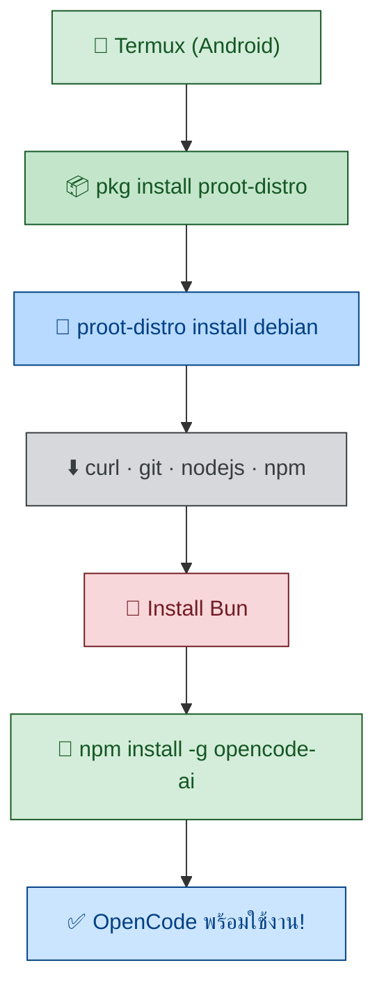

<div align="center">

# 🍃 Debian AI – OpenCode Setup

**ติดตั้ง OpenCode AI บน Termux ผ่าน Debian (proot-distro)**

<p>
  
  &nbsp;&nbsp;
  
</p>

[](https://www.gnu.org/software/bash/)
[](https://opencode.ai)
[](https://termux.com)

</div>

---



## ⚡ วิธีติดตั้ง (คำสั่งเดียว)

```bash
curl -fsSL https://raw.githubusercontent.com/Aa-ok99/debian--ai/main/setup.sh | bash
```

## 📦 สิ่งที่จะติดตั้งโดยอัตโนมัติ

| ลำดับ | รายการ | รายละเอียด |
|------|--------|-----------|
| 1 | **proot-distro** | ระบบจำลอง Linux บน Termux |
| 2 | **Debian** | ระบบปฏิบัติการ Linux |
| 3 | **curl · git · nodejs · npm** | เครื่องมือพัฒนา |
| 4 | **Bun** | Runtime JavaScript สมัยใหม่ |
| 5 | **OpenCode AI** | AI coding agent (global) |

## 🚀 วิธีเข้าใช้งาน

หลังติดตั้งเสร็จ ให้รัน:

```bash
proot-distro login debian
opencode
```

---

<div align="center">

<sub>Repo by [@Aa-ok99](https://github.com/Aa-ok99) | OpenCode is [open source](https://github.com/anomalyco/opencode)</sub>

</div>
