<div align="center">

# 🌸 Debian AI – OpenCode Setup

**ติดตั้ง OpenCode AI บน Termux ผ่าน Debian (proot-distro)**

<p align="center">
  
  
</p>

<!-- Animated Status Badges -->
<p align="center">
  
  
  
  
</p>

<!-- Animated SVG Badges -->
<p align="center">
  
  
  
</p>

[](https://www.gnu.org/software/bash/)
[](https://opencode.ai)
[](https://termux.com)

</div>

---

<div align="center">

## 🔄 ขั้นตอนการติดตั้ง

```mermaid
%%{init: {'theme': 'base', 'themeVariables': { 'primaryColor': '#FFB6C1','primaryTextColor': '#8B0A50','primaryBorderColor': '#FF1493','lineColor': '#FF69B4','secondaryColor': '#FFE4E1','tertiaryColor': '#FFF0F5'}}}%%
flowchart LR
  A["📱 Termux"] --> B["📦 proot-distro"]
  B --> C["🐧 Debian"]
  C --> D["⬇️ Tools"]
  D --> E["🧪 Bun"]
  E --> F["🤖 OpenCode"]
  F --> G["✅ พร้อมใช้!"]

  style A fill:#FFB6C1,stroke:#FF1493,stroke-width:1.5px,color:#8B0A50,font-size:11px
  style B fill:#FFC0CB,stroke:#FF1493,stroke-width:1.5px,color:#8B0A50,font-size:11px
  style C fill:#FFB6C1,stroke:#FF1493,stroke-width:1.5px,color:#8B0A50,font-size:11px
  style D fill:#FFC0CB,stroke:#FF1493,stroke-width:1.5px,color:#8B0A50,font-size:11px
  style E fill:#FFB6C1,stroke:#FF1493,stroke-width:1.5px,color:#8B0A50,font-size:11px
  style F fill:#FFC0CB,stroke:#FF1493,stroke-width:1.5px,color:#8B0A50,font-size:11px
  style G fill:#FF69B4,stroke:#FF1493,stroke-width:2px,color:#FFFFFF,font-size:12px
```



</div>

---

⚡ วิธีติดตั้ง (คำสั่งเดียว)

```bash
curl -fsSL https://raw.githubusercontent.com/Aa-ok99/debian--ai/main/setup.sh | bash
```

<div align="center">

⏳ ใช้เวลาประมาณ 2-5 นาที ขึ้นอยู่กับความเร็วอินเทอร์เน็ต

</div>

---

📦 สิ่งที่จะติดตั้งโดยอัตโนมัติ

ลำดับ รายการ รายละเอียด
1 proot-distro ระบบจำลอง Linux บน Termux
2 Debian ระบบปฏิบัติการ Linux
3 curl · git · nodejs · npm เครื่องมือพัฒนา
4 Bun Runtime JavaScript สมัยใหม่
5 OpenCode AI AI coding agent (global)

---

🚀 วิธีเข้าใช้งาน

หลังติดตั้งเสร็จ ให้รัน:

```bash
proot-distro login debian
opencode
```

---

⭐ การตั้งค่าเพิ่มเติม

เพื่อให้จัดการไฟล์และใช้งานง่ายขึ้นด้วย 2 คำสั่ง:

· d เข้าสู่สภาพแวดล้อม Debian
· c ดูโฟเดอร์และไฟล์ (d_root) ในสภาพแวดล้อม Termux native

สามารถเปลี่ยนหรือตั้งค่าชื่อคำสั่งตามความสะดวกและชอบของผู้ใช้

```bash
ln -s /data/data/com.termux/files/usr/var/lib/proot-distro/containers/debian/rootfs/root $HOME/d_root

echo 'alias d="proot-distro login debian"' >> ~/.bashrc
echo 'alias c="cd ~/d_root && ls -la"' >> ~/.bashrc

source ~/.bashrc
```

---

🎯 ตัวอย่างการใช้งาน

```bash
# เข้าสู่ Debian
d

# ดูไฟล์ใน Termux native
c

# เรียกใช้ OpenCode
opencode
```

---

<div align="center">

📊 สถานะโปรเจค

<p align="center">
  
  
  
</p>

✨ แหล่งข้อมูลเพิ่มเติม

ช่องทาง ลิงก์
📦 OpenCode opencode.ai
📱 Termux termux.com
🐧 Debian debian.org

---

<sub>✨ Repo by @Aa-ok99 | OpenCode is open source</sub>

</div>
